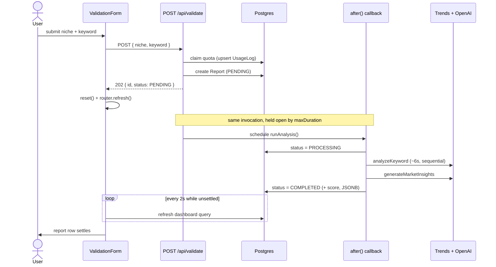
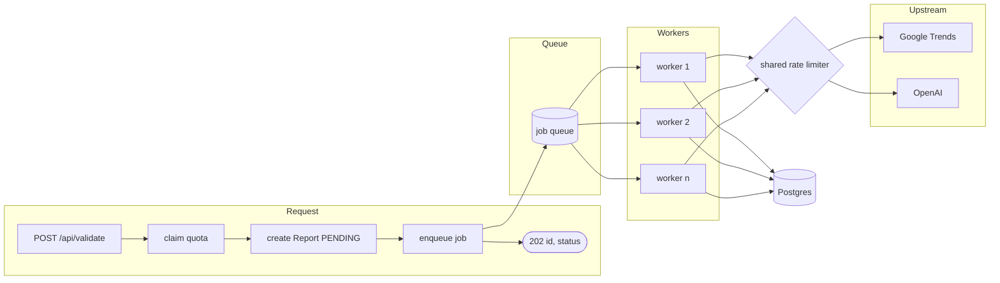
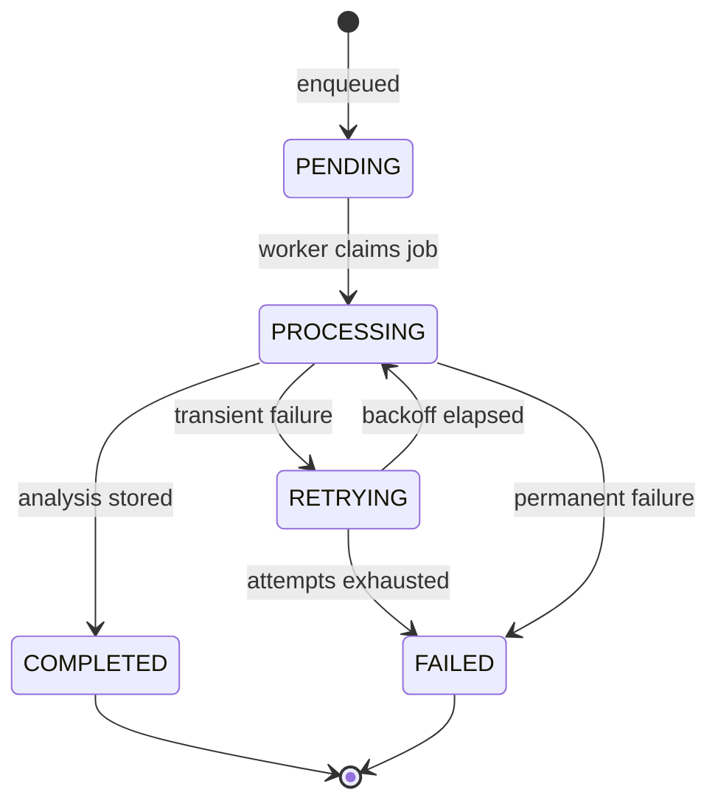
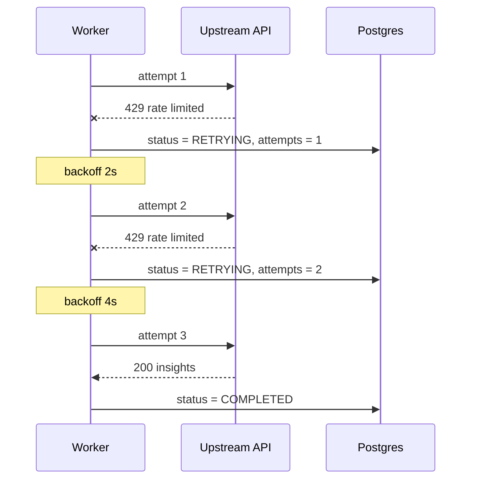

# Report pipeline: queue design (future enhancement)

Status: **proposed, not implemented.** The current pipeline is described first so the
tradeoff is concrete.

## Current design

`POST /api/validate` claims the quota, writes a `PENDING` report, schedules the analysis
with `after()`, and returns `202` immediately. The dashboard polls itself while any report
is unsettled.

### What this costs

`after()` holds the serverless invocation open for the whole analysis — roughly ten
seconds. Concurrency, not database load, is the binding constraint: 100 simultaneous
validations means 100 concurrent long-running invocations.

The upstream APIs break before anything else. The three Google Trends calls in
`analyzeKeyword` share one rate limit, which is why they are sequential with a 2s pause
(`lib/trends/index.ts`). Nothing coordinates that limit *across* requests, so concurrent
validations compete for it and degrade into `partial: true` reports.

There is also no retry. A transient upstream failure marks the report `FAILED`
permanently, and the user has already spent a quota slot.

## Proposed design

Validations become queued jobs. Workers drain the queue at a rate the upstream APIs
tolerate, and the request handler stops doing analysis work.

The request handler returns in milliseconds and holds no long-lived invocation. Worker
count is what bounds upstream pressure, and it is a number you control rather than a
consequence of traffic.

### Job lifecycle

`RETRYING` is the state the current design cannot express. Today any failure is terminal.

### Retry and quota

A job that exhausts its attempts should release the quota slot it claimed. That is the
piece worth getting right — the current behaviour charges the user for an outage.

Exponential backoff matters here specifically because the failure mode is rate limiting.
Retrying immediately makes the problem worse.

## Implementation notes

**Queue choice.** Postgres is already the only stateful dependency, and
`SELECT ... FOR UPDATE SKIP LOCKED` gives a correct work queue without new infrastructure.
Reach for Redis or a hosted queue when throughput genuinely outgrows that, not before.

**`node-cron` is already a dependency** and currently unused. It suits a periodic sweep —
requeueing jobs stuck in `PROCESSING` past a timeout — but it is not a queue by itself,
and workers should not be cron-driven.

**Workers need a host.** Serverless functions are a poor fit for long-running consumers;
this implies a process that stays up, which is a deployment change, not just a code change.

**Schema changes.** A job needs `attempts`, `lastError`, and a claim timestamp. Whether
those live on `Report` or a separate `ReportJob` table is worth deciding deliberately —
`Report` is a domain record, and queue mechanics on it will leak into every report query.

## When to build this

Not yet. The app has no users, and at current volume the polling and `after()` approach is
adequate. The trigger to revisit is either of:

- Google Trends `partial: true` rates rising, which indicates concurrent validations are
  colliding on the shared rate limit
- Serverless concurrency or duration cost becoming visible

Polling on the dashboard is *not* the thing that breaks first, and replacing it with
push-based updates would not address either trigger.
